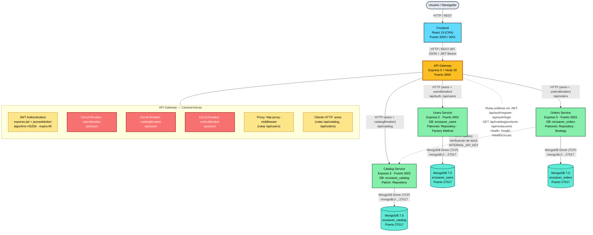

# Arquitectura de Microservicios — EcoSavor

## Descripción

EcoSavor es una plataforma de e-commerce orientada a restaurantes construida bajo
un patrón de **arquitectura de microservicios** con un **API Gateway** como punto
único de entrada. El backend está compuesto por **Node 20 + Express 5**, persiste en
**MongoDB 7.0** (una base de datos separada por servicio) y orquesta todo mediante
**Docker Compose** sobre una red `bridge` (`ecosaver-net`).

El frontend —una SPA en **React 19 (CRA)**— se comunica exclusivamente con el API
Gateway, que centraliza la autenticación JWT, el enrutamiento a los microservicios y
la resiliencia mediante **Circuit Breakers** (librería `opossum`).

Cada microservicio expone su propia API REST y aplica **patrones de diseño** para
separar responsabilidades: los controladores **nunca** hablan directamente con los
modelos —siempre lo hacen a través de **repositorios**.

---

## Diagrama (Mermaid)



> El archivo Mermaid puro (sin wrapper markdown) está disponible en
> [`arquitectura-microservicios.mmd`](./arquitectura-microservicios.mmd).

---

## Versión ASCII

```
                        ┌──────────────────────────┐
                        │   Usuario / Navegador     │
                        └─────────────┬────────────┘
                                      │  HTTP / REST
                                      ▼
                        ┌──────────────────────────┐
                        │  Frontend — React 19     │
                        │  (CRA)  Puerto 3000/3001 │
                        └─────────────┬────────────┘
                                      │  HTTP / REST + JWT Bearer
                                      ▼
   ┌───────────────────────────────────────────────────────────────────┐
   │                     API Gateway — Express 5                       │
   │                          Puerto 3000                              │
   │                                                                   │
   │  ┌─────────────┐  ┌─────────────┐  ┌─────────────┐  ┌─────────┐  │
   │  │ JWT Auth    │  │ usersBreaker│  │catalogBreak │  │ordersBrk│  │
   │  │ express-jwt │  │  opossum    │  │  opossum    │  │ opossum │  │
   │  └─────────────┘  └─────────────┘  └─────────────┘  └─────────┘  │
   │  http-proxy-middleware (/api/users)  ·  axios (/api/catalog,     │
   │                                        /api/orders, /api/auth)   │
   └──────┬───────────────────┬───────────────────────┬───────────────┘
          │ HTTP              │ HTTP                  │ HTTP
          │ (axios+CB)        │ (axios+CB)            │ (axios+CB)
          ▼                   ▼                       ▼
   ┌────────────┐      ┌────────────┐         ┌────────────────┐
   │   Users    │      │  Catalog   │◄───────┤    Orders       │
   │  Service   │      │  Service   │  HTTP   │   Service       │
   │  :3001     │      │  :3002     │ (stock) │   :3003         │
   │ Repository │      │ Repository │ verify  │ Repository      │
   │ Factory    │      │            │         │ Strategy        │
   │  Method    │      │            │         │ (catálogo dep.) │
   └─────┬──────┘      └─────┬──────┘         └────────┬────────┘
         │ TCP               │ TCP                     │ TCP
         │ MongoDB           │ MongoDB                 │ MongoDB
         │ Driver            │ Driver                  │ Driver
         ▼                   ▼                         ▼
   ┌────────────┐      ┌────────────┐          ┌────────────────┐
   │  MongoDB   │      │  MongoDB   │          │    MongoDB     │
   │ ecosaver_  │      │ ecosaver_  │          │  ecosaver_     │
   │   users    │      │  catalog   │          │   orders       │
   │   :27017   │      │   :27017   │          │    :27017      │
   └────────────┘      └────────────┘          └────────────────┘
```

---

## Explicación por capas

### 1. Capa de Cliente — Frontend (React 19)

| Atributo | Valor |
|----------|-------|
| Framework | React 19 (Create React App, JavaScript plano — sin TypeScript) |
| Puerto | 3000 (preferido) / 3001 (auto-bind cuando el backend Docker toma el 3000) |
| Comunicación | HTTP/REST contra el API Gateway, enviando el JWT como `Bearer` token |

El frontend es una SPA que **no conoce la existencia de los microservicios**. Toda
petición pasa por el Gateway (`http://localhost:3000/api/...`). Las rutas públicas
(login, registro, catálogo en modo lectura, listado de restaurantes) no requieren
token; el resto sí.

---

### 2. Capa de Orquestación — API Gateway (Express 5)

| Atributo | Valor |
|----------|-------|
| Runtime | Node 20 + Express 5.x |
| Puerto | 3000 |
| Dependencias clave | `express-jwt`, `jsonwebtoken`, `http-proxy-middleware`, `axios`, `opossum`, `cors`, `morgan` |

El Gateway es el **único punto de entrada** al sistema y centraliza tres
preocupaciones transversales:

#### 2.1 Autenticación JWT
- Middleware `express-jwt` con algoritmo **HS256** y expiración de **8 horas**.
- **Orden crítico en Express 5:** las rutas públicas (`/api/auth/register`,
  `/api/auth/login`, `GET /api/catalog/products`, `/api/restaurants`) se definen
  **antes** del middleware JWT, de lo contrario devuelven 404.
- Método `.unless({ path: [...] })` para eximir rutas públicas.

#### 2.2 Circuit Breakers (opossum)
Tres breakers independientes, uno por microservicio downstream:

| Breaker | Protege a | Estado visible en |
|---------|-----------|-------------------|
| `usersBreaker` | Users Service | `/health/circuits` |
| `catalogBreaker` | Catalog Service | `/health/circuits` |
| `ordersBreaker` | Orders Service | `/health/circuits` |

Cuando un servicio falla repetidamente, el breaker **abre el circuito** y devuelve
`503` con `{ circuitOpen: true }` en lugar de propagar el error, evitando una
cascada de fallos.

#### 2.3 Enrutamiento a microservicios
- **Rutas `/api/users`:** proxy con `http-proxy-middleware` + `pathRewrite`
  (elimina el prefijo `/api/users`), inyectando los headers `X-User-Id` y
  `X-User-Role` desde el payload del JWT.
- **Rutas `/api/catalog` y `/api/orders`:** manejadas con `axios` (a través de
  `createProxyHandler`) porque `http-proxy-middleware` pierde el body en POST/PUT
  bajo Express 5 —gotcha documentado.

#### Endpoints de salud
- `GET /health` — estado del Gateway + stats de los 3 breakers.
- `GET /health/circuits` — detalle de los circuit breakers.

---

### 3. Capa de Microservicios

Todos comparten la misma estructura interna:
`src/{config, controllers, factories, middlewares, models, repositories, routes, services}`.

**Regla arquitectónica clave:** los controladores **nunca** acceden a los modelos
directamente —siempre a través de **repositorios**.

#### 3.1 Users Service (`:3001`)
- **Base de datos:** `ecosaver_users`
- **Patrones de diseño:**
  - **Repository** — abstrae el acceso a Mongoose, desacoplando la lógica de
    negocio del ORM.
  - **Factory Method** — creación de entidades de usuario (buyer / restaurant)
    con configuración distinta según el rol.
- **Funciones:** registro, login (bcrypt), gestión de perfil, listado de
  restaurantes (rol `restaurant`).
- **Tests:** es el único servicio con suite Jest + `mongodb-memory-server` +
  `supertest`.

#### 3.2 Catalog Service (`:3002`)
- **Base de datos:** `ecosaver_catalog`
- **Patrón de diseño:**
  - **Repository** — persistencia de productos y categorías.
- **Funciones:** CRUD de productos, filtrado por categoría y restaurante,
  productos propios del restaurante autenticado.
- **Seguridad interna:** variable `INTERNAL_API_KEY` para llamadas
  servicio-a-servicio.
- **Acceso público:** los `GET` de catálogo son públicos (para invitados y para
  que el frontend no entre en un bucle de auth).

#### 3.3 Orders Service (`:3003`)
- **Base de datos:** `ecosaver_orders`
- **Patrones de diseño:**
  - **Repository** — persistencia de órdenes.
  - **Strategy** — encapsula las transiciones de estado de una orden
    (`pending → confirmed → preparing → ready → complete` / `cancelled`) con
    estrategias intercambiables por estado.
- **Dependencia externa:** consulta al **Catalog Service** (vía `axios`,
  `CATALOG_SERVICE_URL`) para **verificar stock** antes de crear una orden,
  autenticándose con `INTERNAL_API_KEY`.
- **Funciones:** creación, confirmación, avance de estado, cancelación,
  listado y detalle de órdenes.

---

### 4. Capa de Persistencia — MongoDB 7.0

| Base de datos | Servicio dueño | Puerto |
|---------------|----------------|--------|
| `ecosaver_users` | Users Service | 27017 |
| `ecosaver_catalog` | Catalog Service | 27017 |
| `ecosaver_orders` | Orders Service | 27017 |

- **Una DB por servicio** (principio *database-per-service* del patrón
  microservicios), evitando acoplamiento de esquemas entre servicios.
- Contenedor único `mongo:7.0` con credenciales `ecosaver / ecosaver_secret`
  (`authSource=admin`), persistencia en volumen `mongo-data`.
- **Healthcheck:** `mongosh --eval "db.adminCommand('ping')"`.
- Los microservicios esperan a Mongo con `depends_on.condition: service_healthy`.

---

## Comunicación entre componentes

| Origen | Destino | Protocolo | Mecanismo |
|--------|---------|-----------|-----------|
| Usuario | Frontend | HTTP/REST | Navegador → SPA |
| Frontend | API Gateway | HTTP/REST | `fetch` / `axios` con JWT `Bearer` |
| API Gateway | Users Service | HTTP | `http-proxy-middleware` (proxy) |
| API Gateway | Catalog Service | HTTP | `axios` con `catalogBreaker` |
| API Gateway | Orders Service | HTTP | `axios` con `ordersBreaker` |
| Users Service | MongoDB | TCP | MongoDB driver (`mongoose`) |
| Catalog Service | MongoDB | TCP | MongoDB driver (`mongoose`) |
| Orders Service | MongoDB | TCP | MongoDB driver (`mongoose`) |
| Orders Service | Catalog Service | HTTP | `axios` con `INTERNAL_API_KEY` (verificación de stock) |

---

## Despliegue (Docker Compose)

Cinco contenedores sobre la red `ecosaver-net` (driver `bridge`):

| Contenedor | Imagen / Build | Puerto |
|------------|----------------|--------|
| `ecosavor-mongo` | `mongo:7.0` | 27017 |
| `ecosavor-users` | build `./microservices/users` | 3001 |
| `ecosavor-catalog` | build `./microservices/catalog` | 3002 |
| `ecosavor-orders` | build `./microservices/orders` | 3003 |
| `ecosavor-gateway` | build `./api-gateway` | 3000 |

Dependencias de arranque (con `condition: service_healthy`):
- Los tres microservicios esperan a **Mongo**.
- El **API Gateway** espera a los **tres microservicios**.

Imágenes multi-stage: `node:20-alpine` + `npm ci --omit=dev`.

---

## Patrones de diseño implementados

| Patrón | Dónde | Propósito |
|--------|-------|-----------|
| **API Gateway** | `api-gateway` | Punto único de entrada, auth y enrutamiento centralizado |
| **Circuit Breaker** | `api-gateway/src/circuitBreaker.js` (opossum) | Resiliencia ante fallos de servicios downstream |
| **Repository** | Todos los microservicios (`src/repositories/`) | Desacoplar la lógica de negocio del ORM (Mongoose) |
| **Factory Method** | Users Service (`src/factories/`) | Creación de usuarios según rol |
| **Strategy** | Orders Service (`src/strategies/`) | Transiciones de estado de órdenes intercambiables |
| **Proxy** | `http-proxy-middleware` en el Gateway | Reenvío transparente de rutas `/api/users` |
| **Database-per-service** | MongoDB (3 DBs) | Aislamiento de datos entre servicios |
